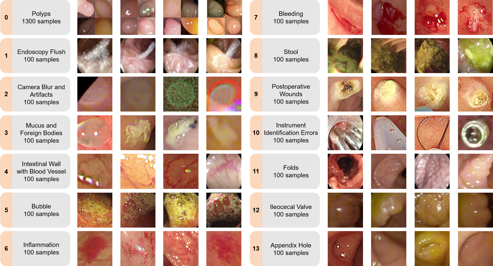

## EndoBoost: a plug-and-play module for false positive suppression during computer-aided polyp detection in real-world colonoscopy (with dataset)

This is the official repo for FPPD-13 dataset and EndoBoost. It provides FPPD-13 dataset download links, preprocessing scripts and implementation of EndoBoost.
[[arXiv]](https://arxiv.org/abs/2212.12204)


### FPPD-13 Dataset

Download FPPD-13 dataset: [[GoogleDrive]](https://drive.google.com/file/d/1ZopmM3M_q87WpXjDdR9iX-vUG6sHp3AT/view?usp=sharing) [[BaiduCloud]](https://pan.baidu.com/s/12EYzYVeUARNsxxn3FTzzEA) (code: fppd)


<p align="center">

</p>


#### Data Organization
The data in FPPD-13 is organized in the following way:

```
├── 0
│   ├── data
│   └── patch
├── 1
│   ├── data
│   └── patch
...
├── 13
│   ├── data
│   └── patch
├── class_id_name.txt
├── fold1
│   ├── test.csv
│   ├── train.csv
│   ...
│   └── val.csv
├── fold2
├── fold3
├── fold4
└── fold5
```

- `class_id_name.txt` provides IDs and names of true positives and all 13 classes of false positives.
- `0` to `13` are colonoscopy images in two formats:
    - `patch`: In this folder, image patch cropped with the prediction bounding box are provided. __Recommended for reproducing experiment results.__
    - `data`: Original images (frames of colonoscopy video) and bounding boxes in `.json` are provided.
- `fold1` to `fold5` contains dataset split files in `.csv` format for all experiments. 

### Code

Code will be publicly available soon!


## Citation

If you use the FPPD-13 dataset or the EndoBoost code please cite:

```
@article{wang2022endoboost,
  title={EndoBoost: a plug-and-play module for false positive suppression during computer-aided polyp detection in real-world colonoscopy (with dataset)},
  author={Wang, Haoran and Zhu, Yan and Qin, Wenzheng and Zhang, Yizhe and Zhou, Pinghong and Li, Quanlin and Wang, Shuo and Song, Zhijian},
  journal={arXiv preprint arXiv:2212.12204},
  year={2022}
}
```